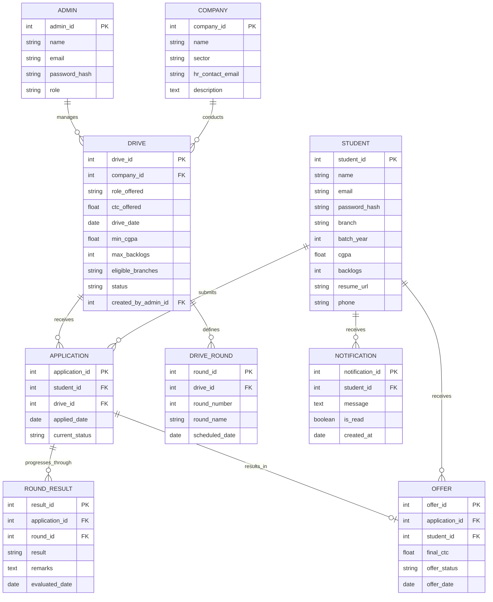

# PlacementIQ — Smart Campus Recruitment & Analytics Platform
### Full Build Specification & Agent Prompt for Antigravity

> **How to use this document:** Upload this entire file to Antigravity as your project brief. It is written as a direct, executable instruction set — Antigravity should treat every section below as a requirement to implement, not a suggestion. Where a decision is left open (marked `[AGENT DECISION]`), pick the most industry-standard option and document the choice in the final SUMMARY.md (see final section).

---

## 1. Project Identity

- **Project Name:** PlacementIQ
- **Tagline:** "One platform for every placement drive, every student, every offer."
- **Type:** Full-stack, database-driven web application
- **Purpose:** Replace manual Excel/WhatsApp-based placement tracking at a college's Training & Placement Cell with a centralized, automated, auditable system.
- **Target Users:** College Placement Officers (Admin), Students, and (optionally) Recruiter-facing view for companies.
- **Academic Context:** This is being built as a CIA-3 university database systems project. It must be genuinely runnable end-to-end, demo-able live, and backed by a real relational database — not mocked data in the frontend.

---

## 2. Objectives (implement features that visibly satisfy each of these)

1. Centralize company, drive, and student data in one normalized relational database.
2. Automate eligibility filtering — no manual cross-checking of CGPA/branch/backlog rules.
3. Track every student's application through every round of every drive in real time.
4. Give the Placement Officer a live analytics dashboard (placement %, average CTC, branch-wise stats, drive success rate).
5. Prevent data conflicts — e.g., a student holding multiple offers must have exactly one "accepted" offer, enforced at the database level, not just app logic.
6. Produce exportable reports (PDF/Excel) for TPO cell records and audits.
7. Be secure: role-based access control, hashed credentials, input validation, SQL-injection-proof queries (parameterized/ORM only).

---

## 3. Tech Stack (use this unless a strong reason to deviate — document any deviation)

| Layer | Technology |
|---|---|
| Frontend | React (Vite) + TailwindCSS + Recharts (for analytics charts) |
| Backend | Node.js + Express.js (REST API) — `[AGENT DECISION]` Python FastAPI is an acceptable substitute if it speeds up delivery |
| Database | PostgreSQL (preferred) or MySQL 8+ — must support triggers, stored procedures, and foreign key constraints |
| ORM / DB Access | Prisma (if Node) or SQLAlchemy (if Python) — no raw string-concatenated SQL anywhere |
| Auth | JWT-based auth, bcrypt password hashing, role-based middleware (Admin / Student) |
| File storage | Local `/uploads` folder for resumes/offer letters is fine for this scope (no cloud storage needed) |
| Charts/Reports | Recharts for in-app dashboards; `pdfkit` or `exceljs`/`openpyxl` for exports |
| Deployment (optional bonus) | Dockerfile + docker-compose for one-command local run |

---

## 4. Database Design — Full Schema

Implement **exactly** this relational structure (3rd Normal Form). This is the academic core of the project — do not simplify it.

### 4.1 Entities & Relationships (ER Diagram — Mermaid)



### 4.2 Key Constraints & Business Rules (must be enforced in DB, not just frontend)

1. **`Application(student_id, drive_id)` must be UNIQUE** — a student cannot apply twice to the same drive.
2. **Eligibility check at application time**: a trigger or backend transaction must reject an `INSERT INTO Application` if `student.cgpa < drive.min_cgpa` or `student.backlogs > drive.max_backlogs` or `student.branch NOT IN drive.eligible_branches`.
3. **One accepted offer per student**: implement a trigger or constraint ensuring only one `Offer` row per `student_id` can have `offer_status = 'Accepted'` at a time. If a student accepts a new offer, prior accepted offers auto-flip to `'Superseded'`.
4. **Cascading status updates**: when all `Round_Result` rows for an `Application` are `'Pass'` and it's the final round, auto-update `Application.current_status = 'Selected'` and auto-generate an `Offer` row (stored procedure or backend transaction).
5. **Foreign keys with `ON DELETE RESTRICT`** on Company→Drive and Drive→Application (never allow orphaned records).
6. **Indexes** on `student_id`, `drive_id`, `company_id`, and `application_id` foreign key columns for query performance — document this choice explicitly in the report.

### 4.3 Required Stored Procedures / Triggers (implement at least these 3 — this is what makes the DB "advanced" for the report)

1. `check_eligibility_before_apply` — trigger, described in 4.2.2
2. `auto_generate_offer_on_selection` — trigger/procedure, described in 4.2.4
3. `enforce_single_accepted_offer` — trigger, described in 4.2.3
4. `[BONUS]` `sp_branch_placement_stats(branch_name)` — stored procedure returning placement %, average CTC, highest CTC for a given branch.

---

## 5. Feature Requirements by Role

### 5.1 Admin (Placement Officer) — full feature list
- Secure login (JWT, hashed password)
- CRUD for Companies
- CRUD for Drives, including setting eligibility criteria (CGPA cutoff, branch list, backlog limit) and defining rounds (e.g., Aptitude → GD → Technical → HR)
- **Auto-eligibility view**: for any drive, show the live-filtered list of eligible students (query, not manual filtering)
- Update round-wise results for applicants (Pass/Fail + remarks) — this should cascade per the trigger rules above
- View and manage Offers (mark accepted/declined/superseded)
- **Analytics Dashboard**:
  - Overall placement % (placed / total eligible students)
  - Branch-wise placement % (bar chart)
  - Average / highest / lowest CTC per branch
  - Drive-wise funnel: applied → shortlisted → selected (funnel chart)
  - Top recruiting companies by offers made
- Export placement report as PDF and Excel (filterable by batch year / branch)
- Send notifications to students (e.g., "New drive posted: XYZ Corp")
- Audit log view: who changed what and when (bonus, if time allows)

### 5.2 Student — full feature list
- Secure registration/login
- Profile management (CGPA, backlogs, resume upload, contact info)
- View list of drives they are eligible for (auto-filtered — student should never see drives they don't qualify for, this proves the eligibility engine works)
- Apply to a drive (button disabled/hidden if ineligible)
- Track own application status across all rounds (visual stepper: Applied → Round 1 → Round 2 → ... → Selected/Rejected)
- View own offer(s) and accept/decline
- Notification inbox (new drives, round results, offer updates)
- Personal placement history/timeline view

### 5.3 `[OPTIONAL BONUS]` Company/Recruiter limited view
- Read-only dashboard for a specific drive: list of applicants, round progress, no access to other companies' data

---

## 6. Non-Functional Requirements

- **Security**: bcrypt password hashing, JWT expiry + refresh handling, parameterized queries only (no raw SQL string concatenation anywhere), role-based route protection on both frontend and backend.
- **Validation**: server-side validation for all forms (CGPA between 0–10, valid email format, no negative CTC, etc.) — do not rely on frontend validation alone.
- **Responsive UI**: must work on both desktop and mobile viewport (use Tailwind responsive classes).
- **Seed data**: populate the database with realistic mock data — at least 10 companies, 15 drives, 60 students across 4 branches, and enough applications/results to make the analytics dashboard show meaningful, non-empty charts. This is critical for a good live demo.
- **Error handling**: meaningful error messages returned from the API (not raw stack traces) and shown gracefully in the UI.

---

## 7. Suggested Project Structure

```
placementiq/
├── backend/
│   ├── src/
│   │   ├── controllers/
│   │   ├── models/ (or prisma/schema.prisma)
│   │   ├── routes/
│   │   ├── middleware/ (auth, roleCheck)
│   │   ├── triggers_and_procedures.sql
│   │   └── app.js
│   ├── seed/ (seed script + mock data)
│   └── package.json
├── frontend/
│   ├── src/
│   │   ├── pages/ (Admin/*, Student/*)
│   │   ├── components/
│   │   ├── charts/
│   │   └── api/
│   └── package.json
├── database/
│   ├── schema.sql
│   ├── er_diagram.png (exported from the mermaid diagram above)
│   └── seed_data.sql
├── docs/
│   └── SUMMARY.md   ← see Section 9, REQUIRED
├── docker-compose.yml
└── README.md
```

---

## 8. Screens to Build (minimum viable set for demo + report screenshots)

**Admin side:** Login → Dashboard (analytics) → Companies list/add → Drives list/add (with eligibility form) → Drive detail (applicant list, round management) → Reports/export page

**Student side:** Login/Register → Profile → Eligible Drives list → Drive detail/Apply → My Applications (status tracker) → My Offers → Notifications

Make sure the UI looks clean and modern (card layouts, proper spacing, a real color scheme, not default unstyled HTML) — screenshots of this go straight into the academic report and need to look "industry grade."

---

## 9. REQUIRED: Post-Build Deliverable — `SUMMARY.md`

**This is the most important instruction in this document.** After the build is complete and working end-to-end, Antigravity must generate a file at `docs/SUMMARY.md` containing:

1. Final tech stack actually used (confirm or note any deviation from Section 3)
2. Final database schema actually implemented (paste final `CREATE TABLE` statements)
3. List of every trigger/stored procedure implemented, with a plain-English explanation of what each does
4. List of all API endpoints built (method + route + purpose)
5. List of all pages/screens built, one line each
6. Confirmation that seed data was loaded, with counts (e.g., "12 companies, 18 drives, 65 students, 140 applications")
7. Any known limitations or features not implemented from this brief, and why
8. Instructions to run the project locally (exact commands)
9. At least 8-10 suggested screenshots to take for documentation, with what each should show (e.g., "Admin dashboard showing branch-wise placement % chart")

**This SUMMARY.md file is what the student will hand back to their AI assistant (Claude) to write the final academic report — it must be detailed enough that no information is lost.**

---

## 10. Notes for the Human (not for Antigravity)

Once Antigravity finishes:
1. Run the project locally and confirm it actually works end-to-end (login as both admin and student, apply to a drive, move it through rounds, generate an offer, check the dashboard updates).
2. Take the screenshots listed in `SUMMARY.md`.
3. Come back to Claude with: this build brief, the generated `SUMMARY.md`, and your screenshots. Claude will write the full 8+ page report (Abstract, Objective, Front-end description, Database report, ER Diagram, Use Cases, DB Connectivity, Results) formatted as a submission-ready Word document.
